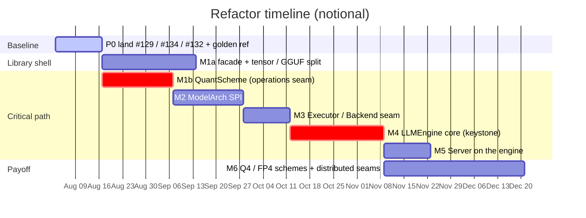
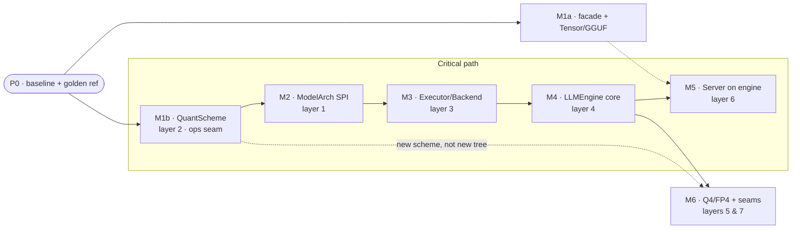
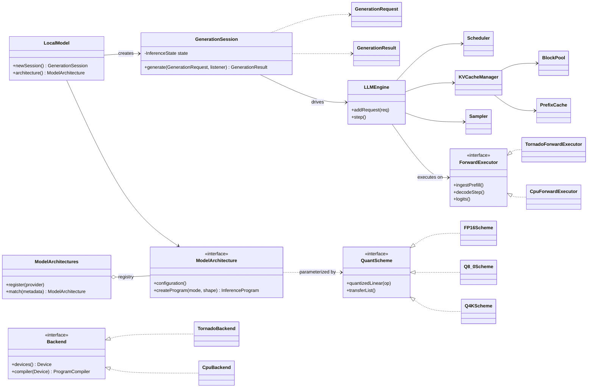
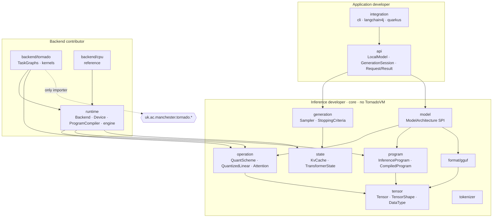

# RFC-001 — GPULlama3 → a proper inference library

- **Status**: Proposed (draft for discussion)
- **Date**: 2026-07-23
- **Baseline**: `main` @15ee2de
- **Anchor issue**: #130 (vLLM-style serving roadmap)
- **Companion docs**: [`MODULARIZATION_ROADMAP.md`](MODULARIZATION_ROADMAP.md) (PR-sized work),
  [`QUANTSCHEME_SEAM_SCOPING.md`](QUANTSCHEME_SEAM_SCOPING.md) (dtype seam detail),
  [`VLLM-ALIGNMENT-AND-FEATURES.md`](VLLM-ALIGNMENT-AND-FEATURES.md) (vLLM v1 mapping, feature matrix, PR analysis),
  [`REFACTOR-EXECUTION-PLAN.md`](REFACTOR-EXECUTION-PLAN.md) (step-by-step, class-by-class)
- **Peers**: llama.cpp · vLLM · qxotic

> Turn a GPU-first LLM codebase into an embeddable, pluggable framework — **without regressing
> correctness, throughput, or the low-bit performance work that actually matters**.

---

## 1. Summary

GPULlama3 already runs seven transformer families on the GPU through TornadoVM, and it already
contains vLLM-class serving mechanics — continuous batching, paged KV, prefix caching. The problem
is **not missing features**; it is that those features are trapped in *implementation groupings*
rather than exposed as *framework abstractions*.

This RFC proposes a behavior-preserving, six-layer refactor delivered as a **strangler migration**:
a thin library façade goes in front of today's engines immediately, while a dtype-as-data seam
underneath unblocks the real prize — native low-bit (Q4 → FP4) tensor-core matmul and a server that
genuinely batches.

**Prime directive**: promote / generalize / de-duplicate. Do **not** re-invent features that
already exist in `bench/BatchedDecodeEngine`. Every phase merges only on **bit-exact logits** and
**no throughput regression**.

This RFC reconciles two prior designs — an internal 6-layer architecture roadmap and a
library-API-first proposal (three audiences: application developer → inference developer → backend
contributor). It keeps the perf-enabling core of the first and folds in the additive library
surface of the second.

---

## 2. Motivation & repo reality

Grounding both prior designs against the actual tree surfaced three realities:

- **R1 — the serving engine is trapped in a benchmark.** Continuous batching, paged KV (block pool
  + block table, ~10.7× less KV), prefix caching and on-device sampling all live in
  `bench/BatchedDecodeEngine` (PR #129), property-driven and hard-cast to LLaMA/Qwen3/FP16/CUDA.
  Promoting this to a reusable `LLMEngine` is the single biggest win.
- **R2 — class explosion is the load-bearing blocker.** 32 hand-written `layers/type/{fp16,q8_0}`
  classes = model × dtype × mode × MMA. Adding Q4/FP4 would multiply this N×. The dtype-as-data
  `QuantScheme` seam must land first, or every later phase fights the explosion.
- **R3 — performance is the point.** GPU compute is FP16/Q8_0 only (`tensor/tornado/`); the CPU path
  already has Q4_K/Q5_K/Q6_K but the GPU does not. The refactor exists to *enable* native low-bit
  tensor-core matmul (the measured #1 decode lever and the qxotic flagship gap), not cleanliness for
  its own sake.

Corroborating structure adopted from the API-first plan: `inference/operation` holds only `RoPE`;
GGUF types are mixed into the `tensor/` package; `tornadovm/plan/*` is the embryo of a
compiled-program layer.

---

## 3. Reconciliation — how the two designs merge

The library-API tracks map cleanly onto the six-layer spine. Nothing is adopted wholesale.

| Library-API track | Lands as | Verdict |
|---|---|---|
| Public façade — `LocalModel` / `GenerationSession` / `GenerationRequest` / `Result` | **M1a** | **ADOPT** — strangler entry; protects LangChain4j / Quarkus |
| Tensor / GGUF separation — generic `Tensor` + `format/gguf` | **M1a** | **ADOPT** — low-risk API-boundary cleanup |
| Operations layer — RMSNorm / RoPE / **QuantizedLinear** / Attention / FFN + parity | **M1b** | **MERGE** — the ops layer *is* the QuantScheme + low-bit seam |
| Program / CompiledProgram split | **M3** | same idea — evolve `tornadovm/plan/*` |
| Backend / Device SPI | **M3** | same idea — from `TensorCoreSupport` |
| Model provider SPI | **M2** | same idea — static registry, not ServiceLoader |
| Loaded-model vs session state / `KvCache` | **M4** | fold into LLMEngine promotion |
| Maven modules (15) | deferred | packages first, modules later |

---

## 4. Milestones & order

**Order:** `P0 → (M1a ‖ M1b) → M2 → M3 → M4 → M5`, then **M6** tracks in parallel.

- **M1a** (façade + tensor/GGUF) and **M1b** (QuantScheme) run **in parallel**: M1a is the cheap,
  visible "looks-like-a-library" shell and is independent of the critical path.
- **M1b is the load-bearing first move** — mechanical, low-risk, and it unblocks both the
  dtype-breadth gap (Q4/FP4) and every later phase.
- Critical path threads `M1b → M2 → M3 → M4 → M5`. **M4 (LLMEngine)** is the keystone. **M6** (the
  payoff) rides on top of M4.

### 4.1 Timeline (notional weeks)

### 4.2 Dependency graph & layer map

### 4.3 Milestone detail

#### P0 — Baseline & golden reference — *prerequisite*
Branch from a settled base; land in-flight PRs that touch the exact files being refactored, then
freeze a reference for the bit-exact gate.
- `#129` static/continuous batched decode — source of the LLMEngine internals.
- `#134` on-device sampling — becomes the `Sampler` strategy.
- `#132` Qwen3 RMS-norm race fix — correctness baseline.
- Add **ArchUnit** dependency rules + allowlist of current violations.
- **Land order** (decision D1): `#132 → #128 → #134 → #129`, then `#120` and `#137`. `#131` stays a
  findings doc (hybrid libs are parity for n=1 decode — do not merge as a feature). See
  [`VLLM-ALIGNMENT-AND-FEATURES.md`](VLLM-ALIGNMENT-AND-FEATURES.md) §3.
- **Exit**: per-layer + final-logit dumps captured per arch × dtype; `BATCHED_DECODE.md`
  reproductions pass.

#### M1a — Library façade + Tensor/GGUF isolation — *library shell · parallel*
Where "looks like a library" is won — cheaply, up front, zero kernel changes.
- `M1a.1` `api/` — immutable, validated `GenerationRequest` / `Result` / `Token`; map current `Options`.
- `M1a.2` `LocalModel` / `LocalModels.load` / `GenerationSession` delegating to existing loaders + engines.
- `M1a.3` `LlamaApp` + LangChain4j / Quarkus become façade consumers.
- `M1a.4` Move GGUF types `tensor/ → format/gguf/`; generic `Tensor` / `TensorShape` / `DataType`.
- **Exit**: README's Java example uses only `api/`; no TornadoVM or GGUF type crosses the façade;
  CLI output byte-identical.

#### M1b — QuantScheme, the operations seam — *layer 2 · load-bearing (keystone)*
Dtype becomes data. Collapse the 32 `layers/type/{fp16,q8_0}` classes to **M model-templates + D
schemes**, expressed as reusable operations (`QuantizedLinear` et al.) with a reference impl and a
CPU/Tornado parity harness — so **Q4/FP4 lands as a new scheme, not a new class-tree**.
- `M1b.1` `QuantScheme` + `FP16Scheme` / `Q8_0Scheme`; make `LlamaFFNLayers` generic over it.
- `M1b.2` Migrate the other 6 archs; delete the `type/{fp16,q8_0}` duplicates.
- `M1b.3` Merge `plan/components/{fp16,q8_0}`; factory dtype switch → `schemeFor()`.
- **Exit**: all 7 archs byte-identical logits vs golden; net LOC down; a dummy scheme registers with
  zero central edits.

#### M2 — Model Architecture SPI — *layer 1*
One provider per architecture behind a **static registry**. Adding a model touches no central file;
the `detectModelType` chain and the `generateTokensLlama/Qwen3` copy-paste both disappear.
- **Exit**: all archs load via the registry, bit-exact; a throwaway dummy arch registers and runs
  with no central edit.

#### M3 — Executor / Backend seam — *layer 3*
CPU and TornadoVM behind one `ForwardExecutor` + `Backend` / `Device` / `DeviceCapabilities` (from
`TensorCoreSupport`). Wrap `tornadovm/plan/*` as `CompiledProgram`s; the three `Model` generate
loops collapse into one. Introduce a **pluggable attention-backend seam** (vLLM-derived) so a
flash-attention decode kernel — a current gap — can drop in without touching model code.
- **Exit**: both paths bit-exact; capability query drives MMA gating; CLI + LangChain4j behavior
  unchanged.

#### M4 — LLMEngine core — *layer 4 · keystone*
Promote `bench/BatchedDecodeEngine` internals into a reusable, model/dtype/backend-agnostic core:
`LLMEngine.addRequest()/step()` over `Scheduler` · `KVCacheManager` (contiguous + paged) ·
`BlockPool` · `PrefixCache` · `Sampler`. One loaded model → many independent sessions.

**Adopted from vLLM v1** (see [`VLLM-ALIGNMENT-AND-FEATURES.md`](VLLM-ALIGNMENT-AND-FEATURES.md) §1):
- **Chunked prefill** — the `Scheduler` mixes prefill + decode tokens in one step, retiring the
  separate prefill/decode plans (better utilisation, one code path).
- **`KVCacheSpec`** — cache layout described independently of the model, inside `KVCacheManager`.
- **EngineCore (sync) + async frontend** split — deterministic core for the bench, async frontend
  for the M5 server; persistent-batch buffer reuse across steps.

- **Exit**: paged ~10.7× less KV; continuous +20% throughput / +24% util; prefix +85% on
  shared-prefix batches — all vs bench parity.

#### M5 — Server on the engine — *layer 6*
The OpenAI server drives `LLMEngine` and actually batches concurrent requests. `InferenceService`
becomes a thin adapter: request → `addRequest`; loop calls `step()`, streams per-request deltas.
- **Exit**: the headline outcome — "batching in a benchmark" becomes "the server batches";
  throughput scales with client count, single-client latency not regressed.

#### M6 — Payoff & seams — *layers 5 & 7 · ongoing*
What the seam unlocked: **Q4_K / FP4 GPU matmul as new `QuantScheme`s** (the qxotic flagship + the
measured #1 decode lever), quantized KV, a speculative-decode hook, new architectures (Gemma 4,
MoE/SSM) as providers, and design-only distributed `ShardPlan` / `ParallelExecutor` seams.
- **Payoff**: unlocks the sm_120 FP4 / FP8 / INT8 tensor cores currently unused at ~117 tok/s on
  RTX 5090.

---

## 5. Target architecture

### 5.1 Type model (key abstractions)

### 5.2 Package / module dependency shape

> Every arrow is an **allowed** dependency. Only `backend/tornado` may import
> `uk.ac.manchester.tornado.*`; `api`, `model`, `format` and `tokenizer` must not — enforced by
> gate **G5**.

### 5.3 Alignment with vLLM v1

vLLM's v1 engine (`vllm/v1/{engine,core,worker,executor,sample,spec_decode,attention}`) maps almost
1:1 onto these layers, which independently validates the design. Four gaps are folded in above —
**chunked prefill** and **`KVCacheSpec`** (M4), **EngineCore + async frontend** (M4/M5), and a
**pluggable attention-backend seam** for flash-attention (M3). Two remain explicit M6 payoff items:
**low-bit quantization** (FP8/FP4, vLLM's Marlin/Machete analog — the M1b seam) and **speculative
decoding**. Full mapping, the feature matrix, and the open-PR analysis live in
[`VLLM-ALIGNMENT-AND-FEATURES.md`](VLLM-ALIGNMENT-AND-FEATURES.md).

---

## 6. Acceptance gates (every PR)

| # | Gate | Definition |
|---|------|-----------|
| **G1** | Bit-exact logits | Per-layer + final-logit equality vs the P0 golden reference, per arch × dtype (deterministic greedy). |
| **G2** | No regression | `--bench` tok/s within noise. Baseline best config: `--cuda-graphs --with-prefill-decode --batch-prefill-size ≥ promptLen`. |
| **G3** | Anti-explosion invariant | A dummy scheme/arch registers and runs with **zero** edits to central files — enforced by a unit test. |
| **G4** | Serving verifies | M4/M5 pass the `BATCHED_DECODE.md` reproductions verbatim. |
| **G5** | ArchUnit rules | `api ⊄ backend`, `model ⊄ tornado`, `format ⊄ inference` — allowlist shrinks each milestone. |
| **G6** | Operation parity | CPU vs Tornado per op, tolerance `\|got−ref\| ≤ 1e-2·Σ\|wᵢaᵢ\| + 1e-3`; skips cleanly with no GPU. |

---

## 7. Decisions

| # | Decision | Resolution | Gates |
|---|----------|-----------|-------|
| D0 | First move — API-first vs perf-seam-first | **Strangler: M1a façade + M1b QuantScheme in parallel** | everything |
| D1 | Sequencing vs #129 / #120 / #134 | Land first, branch from settled base | P0 |
| D2 | SPI mechanism | Static registry (no native-image config) | M2 |
| D3 | Engine package home | `runtime/engine/`, bench becomes a façade | M4 |
| D4 | Distributed depth this round | Seams / design only | M6 |

---

## 8. Success metrics

| Metric | From → to |
|--------|-----------|
| Files to add a dtype | ~23 → **1** (scheme + tensor + one line) |
| Packages to add a model | ~10 → **1** (one provider) |
| Server concurrency | 1 → **N** (single-stream → batched) |
| GPU precision reach | FP16 → **FP4** (past LLaMA/Qwen3/FP16/CUDA) |

### Performance context

Measured on an RTX 4090 (Llama-3.2-3B-Q8): the best config already reaches **~4,500 prefill tok/s**
via batched tensor-core prefill (≈100× over the sequential default), while single-stream decode sits
at ~60 tok/s — bandwidth- and launch-bound. The remaining decode gap to llama.cpp closes on **fewer
bytes per token** (Q4/FP4 fused matmul), on-device sampling, and quantized KV. This RFC's **M1b**
seam is the prerequisite for all three.

---

*RFC-001 · reconciled from two prior drafts and validated against `main` @15ee2de. Open for
discussion on issue #130.*
