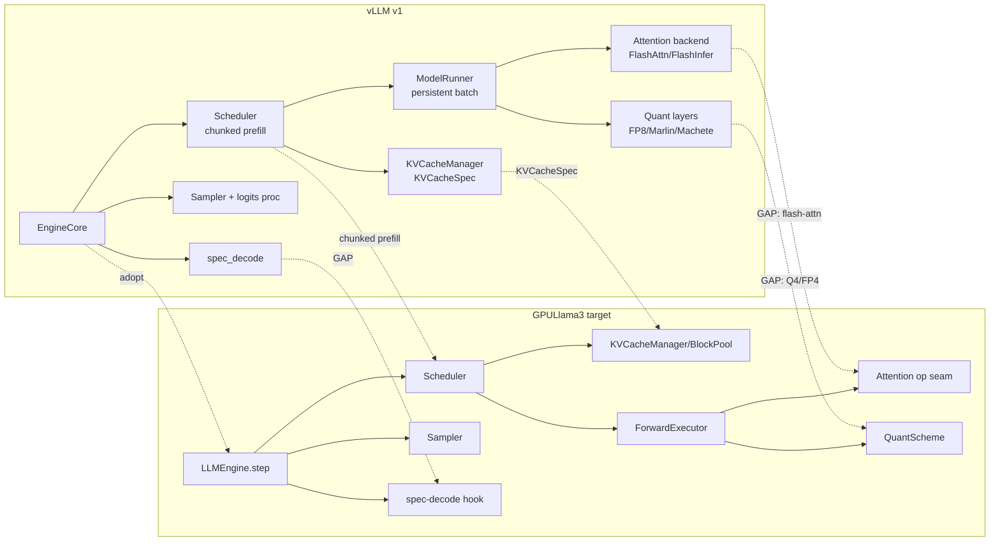

# vLLM alignment, feature matrix & open-PR analysis

Companion to [`RFC-001-inference-library.md`](RFC-001-inference-library.md). Uses vLLM's **v1**
engine architecture as a reference to validate and refine the GPULlama3 refactor, catalogues what
GPULlama3 supports today vs. plans to, and maps the open PRs onto the roadmap.

- **Date**: 2026-07-23
- **Reference**: vLLM v1 (`vllm/v1/*`), validated against the upstream module layout.

---

## 1. vLLM v1 → GPULlama3 target mapping

vLLM v1's layers map almost 1:1 onto the RFC's six-layer target — which independently validates the
design. The mismatches are the useful part: four gaps to fold in.

| vLLM v1 component | Role | GPULlama3 target | Gap / refinement |
|---|---|---|---|
| `v1/engine` **EngineCore** | synchronous step loop | **M4** `LLMEngine.step()` | adopt the **EngineCore (sync) + async frontend** split for the server |
| `v1/core` **Scheduler** | unified prefill+decode, **chunked prefill**, continuous batching | **M4** `Scheduler` | **add chunked prefill** — GPULlama3 *separates* prefill/decode plans; v1 mixes them per step → better utilisation, one code path |
| `v1/kv_cache_interface` + block pool | PagedAttention, `KVCacheSpec` | **M4** `KVCacheManager` / `BlockPool` | mirror the **cache-spec abstraction**: cache layout decoupled from the model |
| `v1/worker` **ModelRunner** + `v1/executor` | persistent batch, TP/PP | **M3** `ForwardExecutor` + **M6** distributed | adopt **persistent-batch buffer reuse**; distributed stays seams-only |
| `attention` backends (FlashAttention / FlashInfer) | pluggable attention kernels | **M1b / M3** operation + backend | **GAP** — no flash-attention decode kernel; add an **attention-backend seam** |
| `model_executor/layers/quantization` (GPTQ / AWQ / **FP8 / Marlin / Machete**) | low-bit tensor-core GEMM | **M1b** `QuantScheme` | **GAP** — exactly the Q4/FP4 payoff M1b unblocks |
| `v1/sample` + logits processors | sampling | **M4** `Sampler` | add a **logits-processor** chain |
| `v1/spec_decode` | draft / EAGLE | **M6** hook | **GAP** — largest single-stream algorithmic lever |
| `v1/structured_output`, `lora`, `multimodal` | guided / adapters / VLM | future | GPULlama3 has only partial structured output |
| `compilation` (torch.compile) + `cudagraph_dispatcher` | graph capture | TornadoVM JIT + CUDA graphs | already the analog — keep |

### Four design edits adopted into the RFC
1. **Chunked prefill** — unify prefill+decode tokens per step in the M4 `Scheduler` (replaces the
   separate prefill/decode plans).
2. **`KVCacheSpec` abstraction** — cache layout described independently of the model, in
   `KVCacheManager`.
3. **Attention-backend seam** — a pluggable attention operation (M1b op + M3 backend) so a
   flash-attention decode kernel can drop in without touching model code.
4. **EngineCore + async frontend** split — sync core for determinism/bench, async frontend for the
   M5 concurrent server.

---

## 2. Feature matrix — supported vs. planned

Legend: ✅ on `main` · 🟡 in open PR / partial · ⬜ planned (roadmap milestone).

| Area | Feature | Status | Where / milestone |
|---|---|---|---|
| **Models** | Llama, Mistral, Qwen2, Qwen3, Phi3, Granite, Devstral | ✅ | `model/*` |
| | Gemma 4 | 🟡 | PR #120 |
| | MoE / SSM / multimodal | ⬜ | M6 / future |
| **Precision (GPU)** | FP16, Q8_0 | ✅ | `tensor/tornado/` |
| | BF16 | 🟡 | PR #120 |
| | Q4_0 / Q4_K / Q5_K / Q6_K | ✅ CPU · ⬜ GPU | `tensor/standard/` · GPU = M6 |
| | FP8 / **FP4 (nvfp4 / mxfp4)** tensor-core | ⬜ | M6 (qxotic flagship) |
| **Backends** | CUDA, PTX, OpenCL, Metal | ✅ | via TornadoVM |
| **Execution** | JIT fused kernels, prefill/decode split | ✅ | `tornadovm/` |
| | MMA tensor-core **batched prefill** (~4500 tok/s) | ✅ | PR #127 |
| | CUDA graphs | ✅ | `--cuda-graphs` |
| | Static **batched decode** (≤41× aggregate) | 🟡 | PR #129 |
| | Continuous batching | 🟡 → ⬜ | PR #129 → M4 |
| | Chunked prefill | ⬜ | M4 (vLLM-derived) |
| **KV cache** | Contiguous | ✅ | — |
| | Paged (block pool, ~10.7× less KV) | 🟡 | PR #129 → M4 |
| | Prefix caching | 🟡 | PR #129 → M4 |
| | Quantized KV | ⬜ | M6 |
| **Sampling** | greedy / temperature / top-p (host) | ✅ | `inference/sampler` |
| | **On-device** sampling (GPU argmax, ~500× less D2H) | 🟡 | PR #134 → M4 |
| | Speculative decoding | ⬜ | M6 |
| **Attention** | Grouped-query attention | ✅ | — |
| | Flash-attention decode kernel | ⬜ | M1b / M3 seam |
| **Serving** | OpenAI-compatible server | ✅ (one-shot) | PR #135 |
| | Concurrent **batched** server | ⬜ | M5 |
| | Structured / guided output | 🟡 | partial |
| | LoRA | ⬜ | future |
| **Interop** | Hybrid CUDA-X (cuBLAS / cuDNN / CUTLASS) | ✅ | TornadoVM — helps prefill/batch; **parity for n=1 decode** (PR #131) |

Measured on RTX 4090 (Llama-3.2-3B-Q8): best config `--cuda-graphs --with-prefill-decode
--batch-prefill-size ≥ promptLen` → **~4500 prefill tok/s** (≈100× over the sequential default),
single-stream decode ~60 tok/s (bandwidth- and launch-bound). The decode gap to llama.cpp closes on
fewer bytes/token (Q4/FP4), on-device sampling, and quantized KV — all gated behind the M1b seam.

---

## 3. Open-PR analysis & land order

8 PRs open on `beehive-lab/GPULlama3.java`.

| PR | What | Size | Maps to | Recommendation |
|---|---|---|---|---|
| **#129** static batched decode (B seqs/step, ≤41× aggregate) | the vLLM-class serving core | +2694 | **M4 source** | **Land first (P0).** Everything in M4 promotes from it. |
| **#134** on-device greedy sampling (GPU argmax, ~500× less D2H) | kills per-token D2H | +118 | **M4 `Sampler`** | **Land first (P0).** Small, high decode value. |
| **#132** Qwen3 RMS-norm cross-workgroup race fix | correctness | +67 | **P0 gate** | **Land first.** Needed for the bit-exact golden reference. |
| **#120** Gemma 4 (CPU+GPU, BF16 + Q8_0) | new architecture | +3139 | **M2 provider** | Land, then **migrate to a provider in M2** — do not hand-wire. |
| **#137** auto-detect TornadoVM backend | UX | +410 | M1a (`DeviceSelector`) | Land anytime; folds into M1a device selection. |
| **#131** hybrid CUDA-lib decode = parity (findings + `logitsLib` switch) | measured **negative** result | +170 | reference only | **Do not merge as a feature** — keep as docs/switch; confirms hybrid libs don't help n=1 decode. |
| **#128** fix negative ArrayList capacity on long prompts | bug fix | +8 | independent | Land — trivial correctness. |
| **#136** README "JVM-native inference & serving engine" | docs / positioning | +190/-388 | library framing | Land; aligns with this RFC. |

**Land order (decision D1):** `#132 → #128 → #134 → #129` (the P0 base), then `#120` and `#137`,
capture the golden reference, then start **M1a ‖ M1b**. `#131` stays a findings doc.
